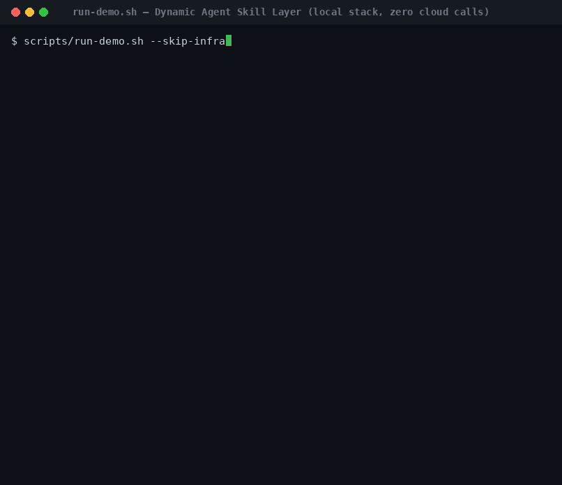

# Dynamic Agent Skill Layer

**A local-first, self-growing skill memory that bolts onto any coding-agent harness — so every session starts with the right know-how already in context, and every useful session leaves new, reviewable skills behind.**

It watches plain `SKILL.md` files, builds a searchable skill graph, injects task-relevant procedures into your agent at session start, captures session transcripts, proposes newly-learned skills as human-gated `.pending` drafts, and keeps the graph fresh — all on your machine, with no cloud dependency on the default path.

This is **infrastructure, not an agent.** It does not orchestrate your agent, manage your chat, or hold a conversation. It is a fixed subsystem your harness calls — the way it calls a language server or a vector DB — to give the agent a working procedural memory.

## See it run

`scripts/run-demo.sh` closes the entire loop against the real local stack — seed skills → graph rebuild → `compile_context` → ingest a transcript → drain the queue → land `.pending` drafts — in ~50s with **zero cloud calls**:



---

## Why this exists

Coding agents keep paying the same taxes a human would:

| Tax | What it costs you today |
|-----|-------------------------|
| **Manual context setup** | You re-explain repo conventions, test commands, deploy quirks, and debugging habits at the start of every session. |
| **Skill rot** | The good instructions exist *somewhere* — a gist, a doc, last week's chat — but nothing retrieves the right one at the right moment. |
| **Harness silos** | Claude Code, OpenCode, Copilot, and Codex don't share procedural knowledge. What you taught one is invisible to the others. |
| **Unsafe auto-memory** | Systems that write memory fully automatically accumulate generic, wrong, or private content and quietly poison retrieval. |
| **Unprovable claims** | Most agent-memory tools *say* they work but have no live, end-to-end evidence — just in-process mocks. |

The skill layer answers each one with an explicit engineering stance: **explicit contracts, local execution, observable files, a human approval gate, and a real-app end-to-end test harness** that drives the actual stack instead of fakes.

---

## What it does

| Capability | Description |
|------------|-------------|
| **Zero-touch context injection** | `compile_context` ranks skills relevant to the current prompt across project + machine-wide scopes and returns harness-ready markdown. A Claude Code hook injects it *before the agent answers* — no manual selection. |
| **Project + global scope** | Project-local skills and machine-wide global skills are searched together with scope-aware ranking and cross-scope de-duplication. Scope is a retrieval boundary, not a different format. |
| **A real self-growing loop** | `SessionEnd` and `PreCompact` capture the transcript into a **durable Postgres queue**. A maintenance worker drains it through a map→reduce extraction pipeline and writes `.pending` skill drafts. |
| **Human-gated mutations** | New skills, merges, retirements, and scope promotions are *proposals*. A human approves by a filesystem action (`mv SKILL.md.pending SKILL.md`). There is no auto-approval path. |
| **Live graph refresh** | An approved skill becomes retrievable by the *running* server after an incremental rebuild and snapshot swap — no restart, no redeploy. |
| **Provider-selectable extraction** | Local Ollama is the default (zero credentials, zero cloud). The Anthropic API and the host-only Claude Code CLI are first-class opt-ins for higher-quality extraction. **Embeddings are always local.** |
| **Filesystem-observable state** | Active skills are `SKILL.md`. Proposals are `.pending`. Retirements are `.retired`. The filesystem *is* the approval UI — no dashboard required. |
| **Proven, not asserted** | The E2E suite drives the real MCP server, graph-builder, Postgres, Redis, Qdrant, and Ollama containers over HTTP — including saturation, convergence, and self-growth "dream-state" contracts. |

---

## How it works

Two loops run continuously around your skill files: a **read loop** that injects context, and a **write loop** that grows new skills. Both meet at the filesystem.

```
                         ┌──────────────────────────  READ LOOP  ──────────────────────────┐
                         │                                                                  │
   your agent prompt ──▶ SessionStart / UserPromptSubmit / PreCompact hook                  │
                         │        │                                                         │
                         │        ▼                                                         │
                         │   compile_context ──▶ dual-scope retrieval (project + global)    │
                         │        │              cosine α + subunit-evidence β, relevance    │
                         │        │              floor, MMR diversity, rescue pool           │
                         │        ▼                                                         │
                         │   harness-ready markdown ──▶ injected into the agent's context   │
                         └──────────────────────────────────────────────────────────────────┘

                         ┌──────────────────────────  WRITE LOOP  ─────────────────────────┐
   session ends /        │                                                                  │
   compaction fires ──▶ SessionEnd / PreCompact ──▶ capture transcript ──▶ durable PG queue │
                         │                                                          │       │
                         │                                                          ▼       │
                         │   maintenance worker drains ──▶ map→reduce extraction:           │
                         │     segment → salience gate → skeleton/prose map →               │
                         │     cosine+LLM reduce → synthesis                                 │
                         │                                                          │       │
                         │                                                          ▼       │
                         │                                          writes  SKILL.md.pending │
                         │                                                          │       │
   human reviews  ◀──────┼──────────────────────────────────────────────────────────┘       │
        │                │                                                                  │
        ▼                │                                                                  │
   mv .pending .md ──▶ graph-builder watcher ──▶ incremental rebuild ──▶ live snapshot swap │
                         │                                              (retrievable now)    │
                         └──────────────────────────────────────────────────────────────────┘
```

**The contract that makes it safe:** nothing the agent does mutates an active skill. Extraction only ever writes `.pending`. A human promotes by renaming. That single rule is why an automated, self-growing system can be trusted not to rot its own memory.

### A skill is just a file

Skills are plain Markdown — portable across projects and harnesses with zero conversion:

```markdown
# git-conventional-commit-workflow
tags: git, commit, workflow, branching, conventional

Conventional commit format and trunk-based git workflow for incremental feature work.

## Procedures
- [procedure] Write a conventional commit message: Format <type>(<scope>): <description>.
  Types: feat, fix, docs, refactor, test, chore. Scope is the affected crate or module.
- [convention] Create feature branches from main: prefix feat/ fix/ docs/; rebase before merge.
```

The H1 is the skill name, `tags:` drives lexical recall, the prose line is the summary that gets embedded (ℓ₁), and each `## Procedures` bullet is a retrievable subunit (ℓ₀) carrying its own evidence signal.

---

## Why adopt it as a fixed subsystem of your harness

- **It's portable by construction.** `SKILL.md` is the universal interchange. The same skill serves Claude Code today and OpenCode/Copilot/Codex tomorrow — scope is a boundary, not a dialect.
- **It's local-first and private.** The default `docker compose up` reaches no cloud. Embeddings (Ollama), vectors (Qdrant), and state (Postgres) are all on your machine. Cloud extraction is an explicit, credential-gated opt-in — never a silent fallback.
- **It fails loud, never fake.** A missing provider credential, an unwired seam, or an unreachable model is a loud error at construction — not a stub that quietly returns plausible garbage.
- **It's observable.** Every skill state is a file you can `ls`. Every graph mutation is recorded in Postgres with before/after snapshots. There is no hidden state to trust.
- **It's honest about retrieval.** A genuinely off-topic prompt returns `no_match` instead of a confident wrong skill — the relevance floor is calibrated against measured negative-query scores, not guessed.
- **It's proven against the real thing.** The E2E harness ingests transcripts over the real HTTP endpoint, drains the real queue, runs real extraction, approves a real draft, and asserts the running server serves the newly-learned skill under concurrent load. Warm single-call `compile_context` retrieval runs ~100ms (release, measured) against a sub-500ms warm-path SLO.

---

## Quickstart

### Prerequisites
- Docker + Docker Compose
- Rust 1.85+ (for local development / running the test suite)

### Prove the whole loop in one command

```bash
scripts/doctor.sh     # ok|warn|fail diagnostics: Docker, env, PG/Redis/Qdrant/Ollama, MCP /health, hooks
scripts/run-demo.sh   # seeds skills, calls compile_context, ingests a transcript, shows the .pending draft
```

`run-demo.sh` exercises the full read+write loop end-to-end and writes a report to `tests/e2e/reports/activation-demo.md`. The default path makes **zero cloud calls** (local Ollama only).

### Stand up the stack

```bash
cp .env.example .env

# The machine-wide global skill store. Default: ~/.claude/skills.
# The maintenance worker fails loudly at boot if this is missing or unwritable.
mkdir -p ~/.claude/skills

docker compose build
docker compose up -d
docker compose ps          # verify health
```

The MCP server exposes tools on `http://127.0.0.1:3001` (health: `/health`); graph-builder health is on `http://127.0.0.1:8080/health`.

> **Global skill store (`SKILL_GLOBAL_HOST_PATH`)** mounts a host directory as `/skills/global` in every container (default `${HOME}/.claude/skills`). Do **not** point it inside this repo — that aims "global" at project docs and pollutes the repo with promotion drafts.

### Wire it into Claude Code

Copy `config/claude-code/hooks.example.json` into your Claude Code settings. The layer wires four lifecycle events:

```
SessionStart      → compile_context (inject)            cold start / resume
UserPromptSubmit  → compile_context (inject)            subsequent prompts (suppressed after first Ok)
PreCompact        → compile_context (trigger=compact)   survive summarization
                  + capture-transcript.sh               snapshot transcript → durable ingest queue
SessionEnd        → capture-transcript.sh               self-growth trigger → durable ingest queue
```

Each hook carries a `result_policy` the harness enforces (`inject_additional_context_on`, `suppress_duplicate_on_healthy`, `retry_on`, `ignore_on`) — see [`docs/reference/capability-catalog.md`](docs/reference/capability-catalog.md).

### Run the tests

```bash
cargo test --workspace                                  # unit + integration
docker compose -f docker-compose.test.yml up --abort-on-container-exit
scripts/run-e2e-tests.sh --include-dream --include-quality   # full live E2E against real containers
```

---

## Architecture

A **CQRS split**: an offline *write side* constructs the skill graph from files; an online *read side* serves retrieval from an in-memory snapshot that refreshes live. Nine Rust crates, each with an explicit feature home:

```
crates/
├── domain/            # Pure domain: types, traits, config (ZERO infrastructure deps)
├── infrastructure/    # Concrete impls: Ollama clients, PG pool, Redis, embeddings, resilience, logging
├── retrieval/         # Online read path: dual-scope cosine ranking over the CQRS snapshot, scoring, MMR
├── compiler/          # Context compilation: template, rescue, harness-ready formatting
├── mcp-server/        # MCP transport: bootstrap, tool handlers, session state, live snapshot refresh
├── graph-builder/     # Offline write path: watcher, extraction, embeddings, HDBSCAN communities, rebuild
├── session-extractor/ # Self-growth: transcript parse, map→reduce orchestration, .pending writer
├── maintenance/       # Human-gated policy passes: merge, retire, promote/demote, cron
└── admin/             # Online admin/debug MCP tools (localhost-only in this phase)
```

**Data plane (all local):** PostgreSQL (relational state, durable transcript queue, before/after audit snapshots), Qdrant (vector search), Redis (event streams + graph-refresh signalling), Ollama (`nomic-embed-text` embeddings, and optional local extraction LLM).

**Multi-level skill graph.** Skills (ℓ₁) and their procedure subunits (ℓ₀) are grouped into **communities** on every rebuild — semantically via **HDBSCAN** over the embeddings *and* lexically by tag, with dual membership — and persisted to Postgres. This is the SkillRAE graph structure that retrieval and future cross-skill reasoning ride on, not a flat list.

### Retrieval model

For a prompt, both scopes are searched concurrently. Each skill scores as **α·(summary cosine) + β·(subunit evidence)** — the ℓ₁ summary vector ranks the skill, while the strongest matching ℓ₀ subunit contributes eq.3 evidence. A **calibrated relevance floor** gates off-topic queries to an honest `no_match`; **MMR** diversifies results; a **rescue pool** surfaces near-misses when the top set is thin. The merge pass uses its *own* body-inclusive candidate vector (distinct from the retrieval ℓ₁ vector) so paraphrased-summary / shared-procedure duplicates are still caught.

### Extraction model

The default path is a map→reduce orchestrator: **segment** the transcript into episodes, **gate** on salience, **map** each episode to a skeleton/prose candidate, **reduce** via cosine + an LLM equivalence verifier, then **synthesize** the surviving candidates into `.pending` drafts. The map and reduce LLM seams are provider-agnostic — the same pipeline runs on Ollama, the Anthropic API, or the Claude Code CLI.

### Extraction providers

| Provider | `EXTRACT_SESSION_PROVIDER` | Runs where | Credential | Use it when |
|----------|----------------------------|------------|------------|-------------|
| **Ollama** (default) | `ollama` or unset | Local container | none | Private, zero-cost, no setup. |
| **Anthropic API** | `claude` | Cloud | `ANTHROPIC_API_KEY` | Highest-quality extraction in CI / containers. |
| **Claude Code CLI** | `claude-code` / `claude-cli` | Host only | existing `~/.claude` login | Subscription users wanting strong extraction with no API-key management. |

Embeddings remain local Ollama (`nomic-embed-text`) in **every** mode — only the extraction LLM is selectable. Selecting a cloud provider without its credential fails loudly at construction.

---

## Key contracts

- **`compile_context` status:** `ok` · `no_match` · `degraded` · `duplicate_suppressed` · `processing` · `failed`
- **Skill lifecycle:** `SKILL.md` (active) → `SKILL.md.pending` (proposed) → `SKILL.md.retired` (retired)
- **Human gate:** every mutation is a `.pending`/`.retired` proposal or an audited record — never an auto-apply
- **Event catalog:** `skill.file_changed`, `skill.extraction_requested`, `extraction.completed`, `extraction.failed`, `graph.rebuilt`, `graph.rebuild_failed`, `skill.retired`, `skill.merged`

Tool contracts: [`docs/reference/capability-catalog.md`](docs/reference/capability-catalog.md) · Runtime states: [`docs/runbooks/degraded-state.md`](docs/runbooks/degraded-state.md) · Online read path: [`docs/reference/online-retrieval-cqrs.md`](docs/reference/online-retrieval-cqrs.md)

## Principles

From [`docs/constitution.md`](docs/constitution.md):

1. **Local-first execution** — the default path reaches no cloud; the data plane is always local.
2. **Zero-touch session start** — context injection requires no manual skill selection.
3. **Human gate for mutations** — `.pending` drafts require a human rename-to-approve.
4. **Portable scope** — skills move between projects and harnesses without conversion.
5. **Filesystem-observable state** — every graph mutation is visible as a filesystem change.

Design basis: the SkillRAE multi-level skill-graph model (offline construction + online retrieval + context compilation), arXiv:2605.10114.

## Contributing

See [`CONTRIBUTING.md`](CONTRIBUTING.md) for development setup, testing conventions, and the crate-by-crate feature-home map.

## License

MIT
